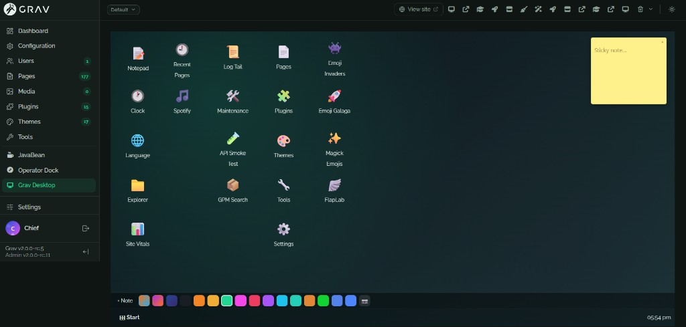
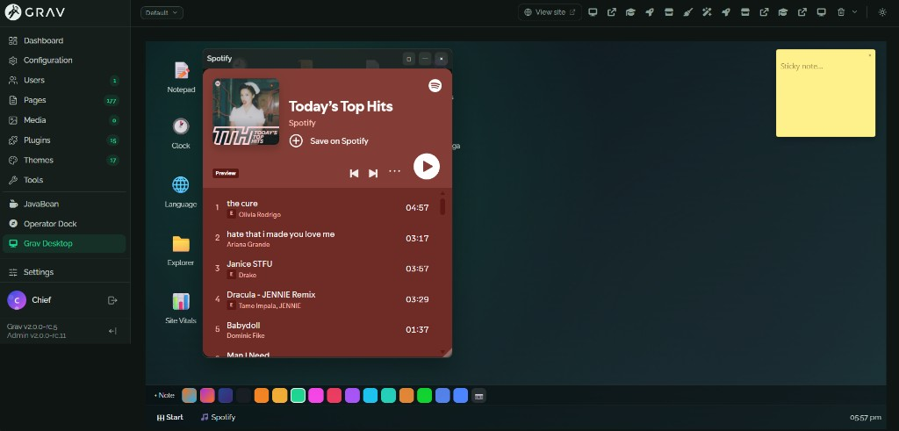
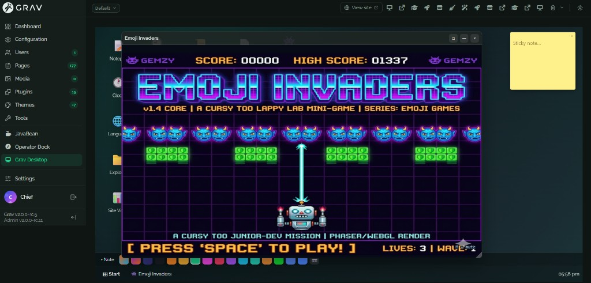
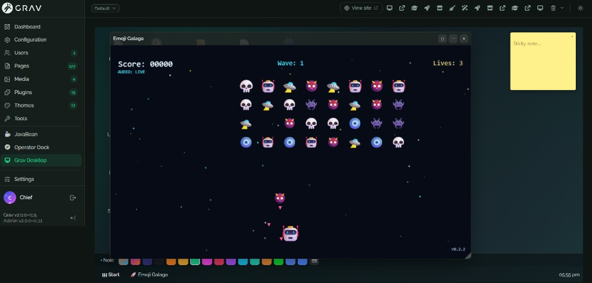
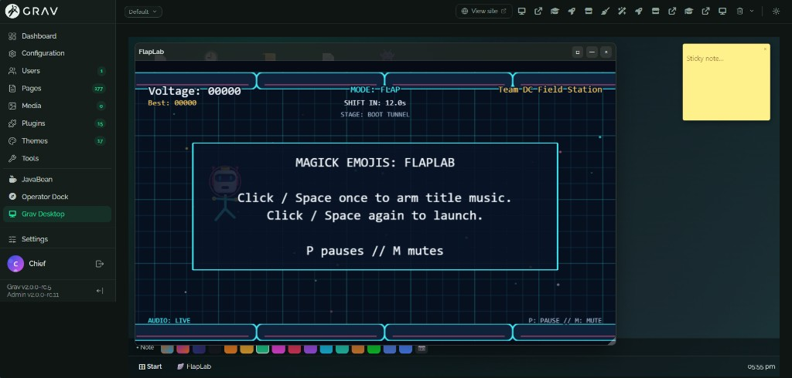

# Grav Desktop for Admin2

**Site:** [desktop.gravmud.site](https://desktop.gravmud.site) · **Repo:** [GravMUD/grav-plugin-grav-desktop-admin2](https://github.com/GravMUD/grav-plugin-grav-desktop-admin2) · **Discussions:** [Community](https://github.com/GravMUD/grav-plugin-grav-desktop-admin2/discussions)

Web desktop inside **Grav 2 Admin2** — icon launcher, draggable windows, taskbar, built-in apps, operator tools, sticky notes, and **Team DC Arcade**.

Free **MIT** plugin by **FutureVision Labs · Team DC**.


## Highlights (v0.6.0)

| Phase | What you get |
|-------|----------------|
| **A — Real** | Site Vitals, Recent Pages, Spotify embed, JavaBean wallpapers |
| **B — Operator** | Log Tail, Maintenance (`.upgrading`), API Smoke Test, GPM Search |
| **C — Delight** | Sticky notes (per-user save), wallpaper preset strip, custom wallpaper upload |

### Desktop

- Full-page **Admin2** plugin (sidebar + optional menubar shortcut)
- **Icons** — drag to reposition (`localStorage`); double-click to open
- **Window manager** — drag, resize, maximize, taskbar, session restore
- **Start menu** — apps grouped by section

### Built-in apps

Notepad (server-saved), Clock, Language switcher, Explorer lite, Site Vitals, Recent Pages, Spotify (configurable), Admin shortcuts (Pages, Plugins, Themes, Tools, Settings).

### Operator tools

Log Tail, Maintenance toggle, API Smoke Test, GPM quick search — optional via plugin settings.

### Delight

- **Sticky notes** on the desktop — drag, edit, delete; saved per admin user
- **Preset strip** above the taskbar — built-ins, JavaBean presets, custom upload
- **Custom wallpaper** per user (WebP via API)

### Team DC Arcade

Emoji Invaders, Emoji Galaga, Magick Emojis, FlapLab — in-window if `assets/arcade/` is populated (see below).

Works alongside **JavaBean** (chrome) and **Operator Dock** (menubar).

## Screenshots

| Desktop overview | Sticky notes & preset strip |
|------------------|----------------------------|
|  |  |

| Spotify in a window | Team DC Arcade |
|---------------------|----------------|
|  |  |

| Emoji Galaga | FlapLab |
|--------------|---------|
|  |  |

## Requirements

- Grav 2.0 RC+
- `admin2` and `api` plugins enabled

## Install

1. Copy `grav-desktop-admin2` into `user/plugins/`
2. Clear cache: `bin/grav cache`
3. Open **Grav Desktop** from the Admin2 sidebar

Or install the release zip from [Releases](https://github.com/GravMUD/grav-plugin-grav-desktop-admin2/releases).

## Configuration

Plugin settings (Admin2 → Plugins → Grav Desktop):

- `show_operator_tools` — Phase B apps (default on)
- `show_delight_features` — master switch for Phase C
- `show_preset_strip` / `show_sticky_notes` — preset bar and stickies
- `wallpaper`, `spotify_embed_url`, `icon_click` (`double` | `single`)

## API (Admin2 API plugin)

| Method | Path |
|--------|------|
| GET | `/grav-desktop/bootstrap` |
| GET/PATCH | `/grav-desktop/notepad` |
| GET/PATCH | `/grav-desktop/sticky-notes` |
| GET/PATCH | `/grav-desktop/wallpaper-prefs` |
| GET/POST/DELETE | `/grav-desktop/wallpaper/custom` |
| GET/PATCH | `/grav-desktop/maintenance` |
| GET | `/grav-desktop/vitals`, `/recent-pages`, `/explorer` |

## Arcade bundle (optional)

The desktop **lists** four Team DC games, but the game files are **not** in the plugin zip (they are large). After install, copy each game's static build into your Grav site:

```text
user/plugins/grav-desktop-admin2/assets/arcade/
  invaders/index.html    ← Emoji Invaders
  galaga/index.html      ← Emoji Galaga
  magick/index.html      ← Magick Emojis
  flaplab/index.html     ← FlapLab
```

Each folder must have an `index.html` at its root (a normal web build / itch export). Grav Desktop opens:

`/user/plugins/grav-desktop-admin2/assets/arcade/{game}/index.html`

inside a window.

**Easy install:** download [`grav-desktop-arcade-bundle.zip`](https://github.com/GravMUD/grav-plugin-grav-desktop-admin2/releases/latest/download/grav-desktop-arcade-bundle.zip) from [Releases](https://github.com/GravMUD/grav-plugin-grav-desktop-admin2/releases), then extract **into** `user/plugins/grav-desktop-admin2/assets/arcade/` (see `INSTALL.txt` inside the zip).

You can also use your own static builds or Team DC itch exports. No special repo layout — only a normal Grav root with this plugin installed.

Without those folders, arcade icons still appear; opening them shows a missing-game message until you add the files.

## Changelog

See [CHANGELOG.md](CHANGELOG.md).

## License

MIT — see [LICENSE](LICENSE).
